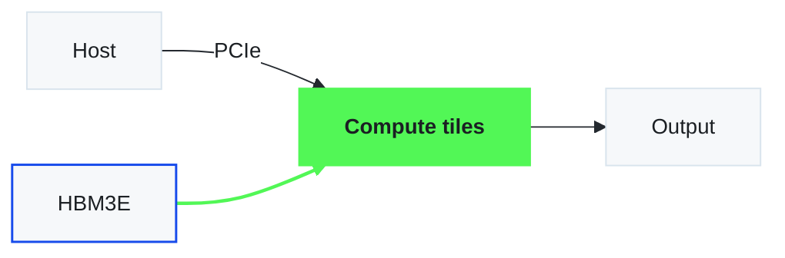

# Diagrams: SVG, Mermaid, architecture and hardware schematics

Source rule (Color Guidelines): for hardware schematics and diagram-heavy
visuals keep a **6 : 2 : 2** ratio — Neon Green : secondary : secondary. The
rest of this file is the skill's extension of that rule to drawing tools.

## What gets which color

| Element | Light surface | Dark surface |
|---|---|---|
| The path / block the diagram is about | fill `#52F756`, text `#1B1F23` | same |
| Second subsystem (e.g. data path) | `#174BEB` stroke or fill, text `#FFFFFF` on fill | same |
| Third subsystem (e.g. control / host) | `#9A4EFF` stroke or fill, text `#FFFFFF` on fill | same |
| Ordinary blocks | fill `#F6F8FA`, stroke `#D9E4ED`, text `#1B1F23` | fill `#24292F`, stroke `#24292F`, text `#F6F8FA` |
| Containers / groups | no fill, stroke `#D9E4ED` 1 px dashed, label `#24292F` | stroke `#BBC4CF`, label `#BBC4CF` |
| Edges / arrows | `#24292F` 1.5 px, arrowhead same color | `#BBC4CF` |
| Highlighted edge | `#52F756` 2.25 px | same |
| Labels on edges | `#24292F` 12–14 px, white halo (`paint-order: stroke`) | `#BBC4CF` |

Count colored elements before drawing: if green is not the majority of the
colored surface, the diagram is telling several stories — split it.

## SVG mechanics

```svg
<svg viewBox="0 0 960 540" xmlns="http://www.w3.org/2000/svg" role="img" aria-labelledby="t">
  <title id="t">REBEL card: HBM3E → compute tiles → PCIe host</title>
  <style>
    text { font-family: Pretendard, "Apple SD Gothic Neo", "Noto Sans KR", sans-serif; font-size: 14px; fill: #1B1F23; }
    .block { fill: #F6F8FA; stroke: #D9E4ED; stroke-width: 1; }
    .hl    { fill: #52F756; stroke: none; }
    .data  { stroke: #174BEB; stroke-width: 1.5; fill: none; }
    .ctrl  { stroke: #9A4EFF; stroke-width: 1.5; fill: none; }
    .edge  { stroke: #24292F; stroke-width: 1.5; fill: none; marker-end: url(#arrow); }
  </style>
  <defs>
    <marker id="arrow" viewBox="0 0 10 10" refX="9" refY="5" markerWidth="8" markerHeight="8" orient="auto-start-reverse">
      <path d="M0 0L10 5L0 10z" fill="#24292F"/>
    </marker>
  </defs>
  <rect class="block" x="60" y="220" width="200" height="100" rx="0"/>
  <text x="160" y="275" text-anchor="middle">HBM3E</text>
  <rect class="hl" x="380" y="200" width="200" height="140"/>
  <text x="480" y="275" text-anchor="middle" font-weight="600">Compute tiles</text>
  <path class="edge" d="M260 270 H380"/>
</svg>
```

- Canvas 960 × 540 (same aspect as a slide) or the container's width; scale
  with `viewBox`, never fixed pixels.
- Square corners on blocks (`rx="0"`) — the deck's tables and bars are square;
  4 px is the most a UI card gets.
- Strokes: 1 px block outlines, 1.5 px edges, 2.25 px the highlighted edge.
- Text 14 px minimum inside blocks; 12 px minimum on edge labels; one weight
  step (600) for the highlighted block's label only.
- No drop shadows, gradients, or 3-D bevels. Depth comes from the fill
  contrast `#F6F8FA` block on `#FFFFFF` page.
- For dark pages swap fills per the table above; do not invert the SVG with CSS
  filters (it turns Neon Green magenta).

## Mermaid

Mermaid is rendered natively in Claude artifacts, GitHub and Notion. Theme it
with an init directive on the first line:



`fontFamily` must sit at the **top level** of the init object. Inside
`themeVariables` Mermaid 11 ignores it and the diagram inherits the page font —
which for a `<pre class="mermaid">` block is monospace, and node labels get
clipped because widths were measured in the wrong face (verified with
mermaid@11 on 2026-09-03). `classDef hl` is the one highlight; `classDef data` /
`ctrl` are the two secondaries. Dark variant: `background`/`clusterBkg`/`edgeLabelBackground` →
`#1B1F23`, `primaryColor`/`secondaryColor`/`noteBkgColor`/`actorBkg` →
`#24292F`, `primaryBorderColor` and friends → `#24292F`, text colors → `#F6F8FA`,
`lineColor`/`signalColor` → `#BBC4CF`.

## Slides and documents

In PowerPoint, draw diagrams with real shapes and connectors (never a pasted
PNG when the deck will be edited) using the same fills; see `pptx.md` for the
OOXML color and font mechanics. In Word / PDF, embed the SVG (or a 2× PNG of it)
at the text column width and put the source line beneath in footnote style.

## Verify

```bash
python3 ${CLAUDE_SKILL_DIR}/scripts/check_colors.py diagram.svg
```

Exit 0, and `#52F756` on the block or edge the title names. Count the colored
elements: green ≥ blue + purple.
